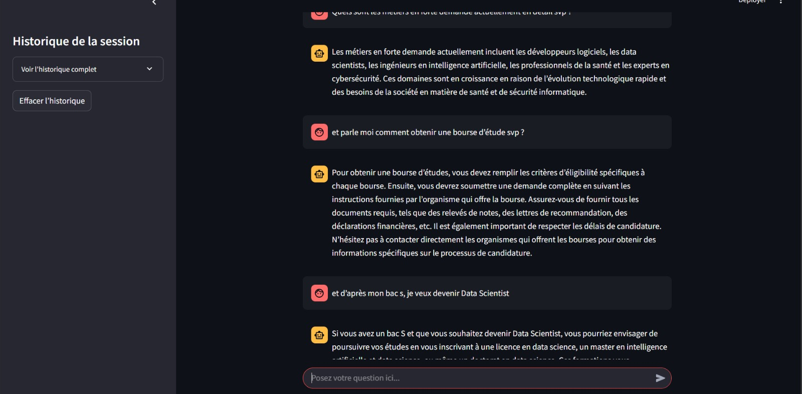

# 🏫 Chatbot d’Orientation Étudiante


## Table of Contents

- [Technologies Utilisées](#technologies-utilisées)
- [Description](#description)
- [Objectifs](#objectifs)
- [Démo](#démo)
- [Installation](#installation)
- [Usage](#usage)
- [Structure du Projet](#structure-du-projet)
- [Collaborateurs](#collaborateurs)
- [Licence](#licence)

---

## Technologies Utilisées


---

## Description

Ce projet met en place un **chatbot d’orientation étudiante** basé sur un **pipeline RAG** (Retrieval-Augmented Generation). L’objectif est de permettre aux étudiants de poser des questions sur :

- Les filières (licences, masters, etc.)  
- Les débouchés professionnels  
- Les modalités d’inscription et prérequis  

Le système exploite une **base de documents** (questionnaires, fiches filières, FAQ universitaires) dont les textes sont **convertis en vecteurs** (embeddings) puis stockés dans un **index** (Chroma). Lorsqu’un étudiant pose une question, le chatbot :

1. **Récupère** les documents les plus pertinents (recherche vectorielle).
2. **Génère** une réponse en s’appuyant sur un modèle de langage (ex. GPT-3.5), qui intègre les extraits de documents pertinents.

---

## Objectifs

1. **Fournir** un moyen rapide et fiable de répondre aux questions des étudiants concernant leur orientation.  
2. **Assurer** la pertinence en s’appuyant sur des documents validés (brochures, FAQ, etc.).  
3. **Proposer** une interface simple (Streamlit) pour interagir avec le chatbot.  

---

## Démo



```bash
streamlit run app.py
